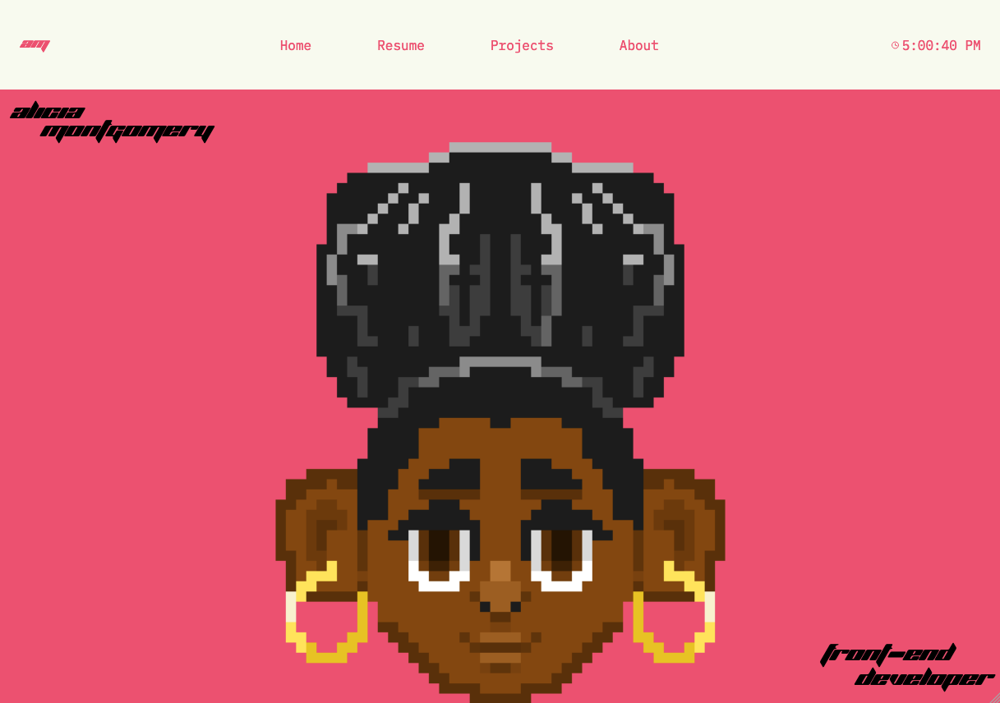

# Alicia's Portfolio Website
I created this website to showcase all my web dev skills and other projects. Made using the three fundamental building blocks of the web: HTML, CSS, and Javascript. 

## Process
I began by creating the design for the website in Figma. I had a general idea of what information I wanted on the site. Using Figma helped me solidify precisely where everything would fit. I made the mobile designs to ensure the website would work on mobile devices and scaled the designs to other formats.

After that, I started making the website. I used grids and flexboxes throughout the website to ensure the layout scaled when transitioning from mobile to desktop. I created custom graphics for the home and about pages. 

Lastly, I tied everything up and shipped it to the web using Vercel through the CI/CD pipeline from GitHub. Now, my project is up on the web!

### Technologies/ Tools
 - Figma
 - HTML
 - CSS
 - JavaScript
 - Github
 - Vercel
 
 ### Links
 
|Name|Link|
|--|--|
| Website |https://www.aliciamontgomery.me/|
| Figma |[Figma File](https://www.figma.com/file/vvOIAGsoKWQBqPppJPY2Fn/Portfolio-site?type=design&node-id=229:12&mode=design&t=WU9YlSVZUTpCgpUx-1)|
